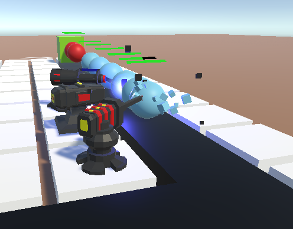

# Tower defense # 

A typical tower defense game made for learning Unity 



## How to play ##

Probably build it as a executable one day 

## Special Feature (a.k.a not copy code) ##

### Target System ###

Total 5 target method implemented in game
```
0 : Nearest
1 : First
2 : Last
3 : Strongest
4 : Weakest
```

### Enemies spawning system ###

Calculate enemies spawned each wave based on different parameters 
``` c#
public class EnemySpawn
{
   public GameObject enemy; // enemy prefab
   public int baseCount; // init no. of enemy each wave 
   public float baseRate; // init rate of enemy each wave
   public int incCount; // increase no. of enemy per 5 wave
   public int incRate; // increase rate of enemy per 5 wave
   public int startLevel; // level that enemy start spawning 
}
```

## Upcoming Feature (a.k.a never happen) ##

### Shop for buying turret ### 
Build a new scene and earn coin for buying new turret after playing 

### BGM ###
Currently the game has no sound (which is boring)

### UI remake ### 
Ugly as usual, add some animation 

### Multiple Map ### 
Better background but not only plain color 

### More upgrade ### 
3-4 upgrades with model change / new skill 

### More enemy types ### 
Boss enemy / split enemy / spawner 

### Multiplayer ### 
I have no idea how to do ._.

### Mobile support ### 
Unity save me

## Credit ## 

[Cool Tutorial](https://www.youtube.com/playlist?list=PLPV2KyIb3jR4u5jX8za5iU1cqnQPmbzG0)